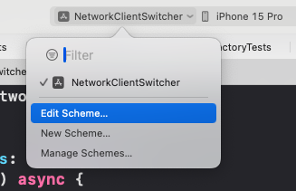
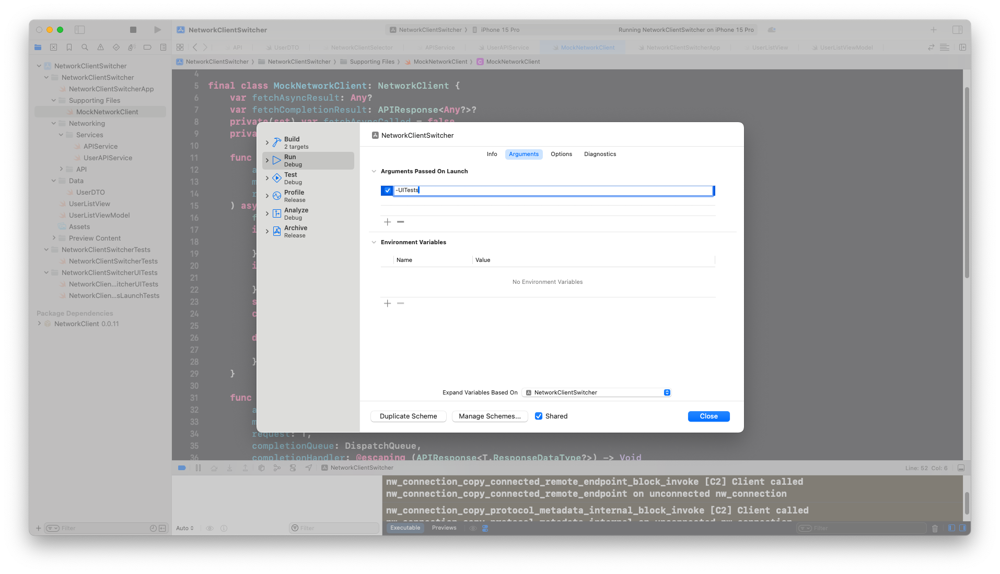

# Leveraging Launch Arguments for Effective UI Testing in iOS
## Mock data now works!

This runs alongside my development of a simple design library system that I'm going to import in my project apps and tutorial projects. Take a look at (https://github.com/stevencurtis/DesignLibrary/tree/main)[https://github.com/stevencurtis/DesignLibrary/tree/main].
This article also uses my Network Client (https://github.com/stevencurtis/NetworkClient)[https://github.com/stevencurtis/NetworkClient] and this article will not cover that ground, but feel free to take a look at that link for more information.

Difficulty: Beginner | Easy | **Normal** | Challenging<br/>
This article has been developed using Xcode 15.0, and Swift 5.9

## Terminology:
Launch arguments: Launch arguments are command-line parameters passed to an application at startup, used to modify its behaviour. Typically used for debugging, testing and configuration purposes.

# The background
You might have a project that downloads from a BE, here the example endpoint is from `https://jsonplaceholder.typicode.com/users` which gives a rather nice list of users from a test endpoint.

This is fine, and I'm sure most people reading this article will be able code a solution that downloads from the endpoint. However during development you will always need an Internet connection. Worse, if you develop any `UITest` and the backend changes your tests will fail.

Here is how you can implement a solution to this common problem.

# The code
Essentially there is a selector we use to decide if we are using a mocked network client suitable for testing or one suitable for release.

```swift
struct NetworkClientSelector {
    static func select() -> NetworkClientConfiguration {
        #if DEBUG
        if ProcessInfo.processInfo.arguments.contains("-UITests") {
            return DebugNetworkClientConfiguration()
        }
        #endif
        return ReleaseNetworkClientConfiguration()
    }
}
```

The NetworkClientConfiguration is not particularly complex. Either we choose the `MockNetworkClient` or the `MainNetworkClient`

```swift
protocol NetworkClientConfiguration {
    var networkClient: NetworkClient { get }
}

struct DebugNetworkClientConfiguration: NetworkClientConfiguration {
    var networkClient: NetworkClient {
        MockNetworkClient()
    }
}

struct ReleaseNetworkClientConfiguration: NetworkClientConfiguration {
    var networkClient: NetworkClient {
        MainNetworkClient()
    }
}
```

## MockNetworkClient
Here is the `MockNetworkClient`. Ideally this would be in a framework that can be accessed from both the tests and main project.

```swift
import Foundation
import NetworkClient

final class MockNetworkClient: NetworkClient {
    var fetchAsyncResult: Any?
    var fetchCompletionResult: APIResponse<Any?>?
    private(set) var fetchAsyncCalled = false
    private(set) var fetchCompletionCalled = false
    
    func fetch<T>(
        api: URLGenerator,
        method: HTTPMethod,
        request: T
    ) async throws -> T.ResponseDataType? where T: APIRequest {
        fetchAsyncCalled = true
        if let error = try (fetchAsyncResult as? APIResponse<APIError>)?.result.get() {
            throw error
        }
        if let result = fetchAsyncResult as? T.ResponseDataType {
            return result
        }
        switch api.url {
        case API.users.url:
            return mockUsers() as? T.ResponseDataType
        default:
            return nil
        }
    }
    
    func fetch<T>(
        api: URLGenerator,
        method: HTTPMethod,
        request: T,
        completionQueue: DispatchQueue,
        completionHandler: @escaping (APIResponse<T.ResponseDataType?>) -> Void
    ) -> URLSessionTask? where T: APIRequest {
        fetchCompletionCalled = true
        if let result = fetchCompletionResult as? APIResponse<T.ResponseDataType?> {
            completionQueue.async {
                completionHandler(result)
            }
        }
        return nil
    }
    
    private func mockUsers() -> [UserDTO] {
        [
            UserDTO(id: 1, username: "Username One"),
            UserDTO(id: 2, username: "Username Two")
        ]
    }
}
```

## MainNetworkClient
This is in my (https://github.com/stevencurtis/NetworkClient)[https://github.com/stevencurtis/NetworkClient] but I'll repeat it here for clarity.
```swift
import Foundation

public final class MainNetworkClient: NetworkClient {
    private let urlSession: URLSession
    
    public init(urlSession: URLSession = .shared) {
        self.urlSession = urlSession
    }
    
    public func fetch<T: APIRequest>(
        api: URLGenerator,
        method: HTTPMethod,
        request: T
    ) async throws -> T.ResponseDataType? {
        let urlRequest = try createURLRequest(api: api, method: method, request: request)
        let (data, response) = try await urlSession.data(for: urlRequest)
        let httpResponse = try self.handleResponse(data, response)
        try handleStatusCode(statusCode: httpResponse.statusCode)
        return httpResponse.statusCode == 204 ? nil : try parseData(data, for: request)
    }
    
    @discardableResult
    public func fetch<T: APIRequest>(
        api: URLGenerator,
        method: HTTPMethod,
        request: T,
        completionQueue: DispatchQueue,
        completionHandler: @escaping (APIResponse<T.ResponseDataType?>) -> Void
    ) -> URLSessionTask? {
        do {
            let urlRequest = try createURLRequest(
                api: api,
                method: method,
                request: request
            )
            let task = urlSession.dataTask(with: urlRequest) { data, response, error in
                if let error = error {
                    self.completeOnQueue(
                        completionQueue,
                        with: .failure(.network(errorMessage: error.localizedDescription)),
                        completionHandler: completionHandler
                    )
                    return
                }
                
                if (response as? HTTPURLResponse)?.statusCode == 204 {
                    self.completeOnQueue(
                        completionQueue,
                        with: .success(nil),
                        completionHandler: completionHandler
                    )
                    return
                }
                
                guard let validData = data else {
                    self.completeOnQueue(
                        completionQueue,
                        with: .failure(.noData),
                        completionHandler: completionHandler
                    )
                    return
                }
                do {
                    let httpResponse = try self.handleResponse(validData, response)
                    try self.handleStatusCode(statusCode: httpResponse.statusCode)
                    if case .delete = method {
                        self.completeOnQueue(
                            completionQueue,
                            with: .success(nil),
                            completionHandler: completionHandler
                        )
                    } else {
                        let parsedResponse = try self.parseData(validData, for: request)
                        self.completeOnQueue(
                            completionQueue,
                            with: .success(parsedResponse),
                            completionHandler: completionHandler
                        )
                    }
                } catch let apiError as APIError {
                    self.completeOnQueue(
                        completionQueue,
                        with: .failure(apiError),
                        completionHandler: completionHandler
                    )
                } catch {
                    self.completeOnQueue(
                        completionQueue,
                        with: .failure(.unknown),
                        completionHandler: completionHandler
                    )
                }
            }
            task.resume()
            return task
        } catch let apiError as APIError {
            completeOnQueue(
                completionQueue,
                with: .failure(apiError),
                completionHandler: completionHandler
            )
            return nil
        } catch {
            completeOnQueue(
                completionQueue,
                with: .failure(.unknown),
                completionHandler: completionHandler
            )
            return nil
        }
    }
    
    private func createURLRequest<T: APIRequest>(api: URLGenerator, method: HTTPMethod, request: T) throws -> URLRequest {
        let urlRequest = try request.make(api: api, method: method)
        return urlRequest
    }
    
    private func handleResponse(_ data: Data, _ response: URLResponse?) throws -> (HTTPURLResponse) {
        guard let httpResponse = response as? HTTPURLResponse else {
            throw APIError.invalidResponse(data, response)
        }
        return httpResponse
    }
    
    private func parseData<T: APIRequest>(_ data: Data, for request: T) throws -> T.ResponseDataType {
        try request.parseResponse(data: data)
    }
    
    private func handleStatusCode(statusCode: Int) throws {
        switch statusCode {
        case 200 ..< 300:
            break
        case 400:
            throw APIError.httpError(.badRequest)
        case 401:
            throw APIError.httpError(.unauthorized)
        case 403:
            throw APIError.httpError(.forbidden)
        case 404:
            throw APIError.httpError(.notFound)
        case 500:
            throw APIError.httpError(.serverError)
        default:
            throw APIError.httpError(.unknown)
        }
    }
    
    private func completeOnQueue<T>(
        _ queue: DispatchQueue,
        with response: APIResponse<T>,
        completionHandler: @escaping (APIResponse<T>) -> Void
    ) {
        queue.async {
            completionHandler(response)
        }
    }
}
```

# The testing
## Unit tests
We can inject the `MockNetworkClient` through initializers, here is the service.
```swift
final class APIServiceTests: XCTestCase {
    private var sut: APIService!
    private var mockNetworkClient: MockNetworkClient!
    override func setUp() {
        super.setUp()
        sut = APIService()
    }
    
    func testPerformRequestSuccess() async {
        // Given
        let mockNetworkClient = MockNetworkClient()
        let userRequest = UserRequest()
        let mockUsers = [UserDTO(id: 1, username: "name")]
        
        // When
        mockNetworkClient.fetchAsyncResult = mockUsers

        do {
            let response = try await sut.performRequest(
                api: .users,
                method: .get(),
                request: userRequest,
                networkClient: mockNetworkClient
            )
            // Then
            XCTAssertNotNil(response)
        } catch {
            XCTFail("Unexpected error: \(error)")
        }
    }
}
```
## UITests

`pp.launchArguments = ["-UITests"]` during setup will enable the mock data to be selected. 

This results in the following code:

```swift
import XCTest

final class NetworkClientSwitcherUITests: XCTestCase {
    let app = XCUIApplication()

    override func setUpWithError() throws {
        continueAfterFailure = false
        app.launchArguments = ["-UITests"]
        app.launch()
    }

    func testUserListLoads() throws {
        let app = XCUIApplication()
        let userCellOne = app.staticTexts["Username One"]
        XCTAssertTrue(userCellOne.exists)
        let userCellTwo = app.staticTexts["Username Two"]
        XCTAssertTrue(userCellTwo.exists)
    }
}
```

# Switching The Scheme
In Xcode you are able to edit a scheme, so you can choose which scheme to choose (and therefore are you going to use the MockNetworkClient or the release version).





Simply by flipping the `-UITests` argument on or off as appropriate.

# Alternatives
While leveraging launch arguments for UI testing in iOS offers a streamlined approach to simulate different application states and configurations, it's worth exploring alternative strategies that can also enhance your testing framework's flexibility and robustness. Environment variables, for instance, provide a similar level of control and can be used in tandem with or as a substitute for launch arguments to dictate app behavior during tests. Additionally, configuration files can offer a more structured and maintainable way to manage multiple testing scenarios, allowing for easy adjustments without altering the codebase. Another approach involves using dependency injection frameworks to dynamically switch between production and mock services, offering a code-centric way to control your app's environment.

# Conclusion
Mastering the use of launch arguments for UI testing in iOS represents a significant step forward in creating more reliable, efficient, and independent tests. By decoupling our tests from live back-end systems, we not only gain control over the testing environment but also ensure that our tests remain robust against external changes. The techniques outlined in this article, from configuring MockNetworkClient for UI tests to switching schemes for different testing scenarios, provide a solid foundation for any iOS developer looking to improve their testing strategy. As we continue to explore and innovate within the realm of iOS development, embracing such practices will undoubtedly lead to higher quality applications and a more streamlined development process.

Thanks for reading!

If you've any questions, comments or suggestions please hit me up on [Twitter](https://twitter.com/stevenpcurtis) 
