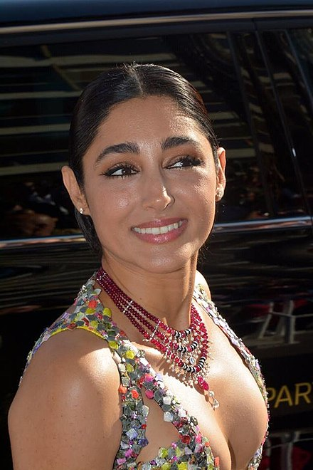

# Animate UIViewController Transitions with UIViewControllerAnimatedTransitioning
## Make it nice

<br/>
<sub>-<sub>

# Prerequisites:
You will need to be familiar with the basics of [Swift and able to start a Playground (or similar)](https://medium.com/@stevenpcurtis.sc/coding-in-swift-playgrounds-1a5563efa089)

# Terminology:
UIViewControllerAnimatedTransitioning: A set of methods for implementing the animations for a custom view controller transition

# Wouldn't it be nice?
If we could use `UIViewControllerAnimatedTransitioning` to make a nice transition from a `UICollectionView` to  a detail view? 

What? It would?

<br/>

# The trivialities
Yes, that is a `UICollectionView` that displays the data. Rather than using an endpoint I'm using an internal JSON file. Here's the JSON with just the first person:

```JSON
[
  {
    "name": "Donald J Trump",
    "email": "covfefe@gov.com",
    "job": [{
      "role": "President",
      "industry": "Politics"
      }],
    "image": "Don"
  }
]
```

which is then decoded from the main bundle [using an extension](https://github.com/stevencurtis/SwiftCoding/tree/master/Tips/CodeSnippets#Decode-a-file-from-the-bundle)

The images are then stored in the asset catalog (they are all squares to make this a little bit easier to implement. Incidentally in the storyboard for the `DetailViewController` I've decided to set the content mode to `Scale To Fill` as if not choosing `Aspect Fit` will not help the animation.

<br/>

This looks something like the following:

```swift
class ViewController: UIViewController {
    
    // equivalent of a Fatal Error, if the json file does not exist
    lazy var people: [PeopleModel] = try! Bundle.main.decode([PeopleModel].self, from: "Peeps.json")
    
    private var originalCellFrame : CGRect?
    
    lazy var collectionView: UICollectionView = {
        let layout = UICollectionViewFlowLayout()
        layout.scrollDirection = .horizontal
        
        let collection = UICollectionView(frame: CGRect(x: 0, y: 0, width: 0, height: 0), collectionViewLayout: layout)
        collection.translatesAutoresizingMaskIntoConstraints = false
        collection.backgroundColor = .systemGray
        collection.isScrollEnabled = true
        return collection
    }()
    
    override func viewDidLoad() {
        super.viewDidLoad()
        
        self.navigationController?.delegate = self
        
        self.view.addSubview(collectionView)
        setupConstraints()
        setupCollectionView()
    }
    
    func setupCollectionView() {
        let nib = UINib(nibName: "PersonCollectionViewCell", bundle: Bundle.main)
        collectionView.register(nib, forCellWithReuseIdentifier: "cell")
        collectionView.delegate = self
        collectionView.dataSource = self
        
    }
    
    func setupConstraints() {
        NSLayoutConstraint.activate([
            collectionView.topAnchor.constraint(equalTo: self.view.topAnchor),
            collectionView.bottomAnchor.constraint(equalTo: self.view.bottomAnchor),
            collectionView.leadingAnchor.constraint(equalTo: self.view.leadingAnchor),
            collectionView.trailingAnchor.constraint(equalTo: self.view.trailingAnchor)
        ])
    }
}

extension ViewController: UICollectionViewDelegate {
    func collectionView(_ collectionView: UICollectionView, didSelectItemAt indexPath: IndexPath) {
        
        // we need to have the original frame for the cell, in the superview co-ordinate system
        let layoutAttributes: UICollectionViewLayoutAttributes! = collectionView.layoutAttributesForItem(at: indexPath)
        originalCellFrame = collectionView.convert(layoutAttributes.frame, to: collectionView.superview)
        
        self.performSegue(withIdentifier: "detail", sender: indexPath.row)
    }
    
    override func prepare(for segue: UIStoryboardSegue, sender: Any?) {
        if let row = sender as? Int, (segue.identifier == "detail") {
            let detailVC = segue.destination as! DetailViewController
            detailVC.person = people[row]
        }
    }
}

extension ViewController: UICollectionViewDelegateFlowLayout {
    func collectionView(_ collectionView: UICollectionView, layout collectionViewLayout: UICollectionViewLayout, sizeForItemAt indexPath: IndexPath) -> CGSize {
        let width = min(self.collectionView.frame.width, self.collectionView.frame.height)
        return CGSize(
            width: width / 1.5,
            height: width / 1.5)
    }
}

extension ViewController: UICollectionViewDataSource {
    func collectionView(_ collectionView: UICollectionView, numberOfItemsInSection section: Int) -> Int {
        people.count
    }
    
    func collectionView(_ collectionView: UICollectionView, cellForItemAt indexPath: IndexPath) -> UICollectionViewCell {
        if let cell = collectionView.dequeueReusableCell(withReuseIdentifier: "cell", for: indexPath) as? PersonCollectionViewCell {
            cell.imageView.image = UIImage(named: people[indexPath.row].image)
            return cell
        }
        fatalError("Could not dequeue cell")
    }
}
```

One important part here is we have a property `originalCellFrame`, as we need to know the frame (so in the superview coordinates) of the cell that we actually click on (set in `func collectionView(_ collectionView: , didSelectItemAt indexPath:)`).

Since we are navigating in a `UINavigationController`, with the basic storyboard as follows:

<br/>

# The Animation
The solution uses `UINavigationControllerDelegate`, that means that we need to know whether the view is being presented or is resigning. To do so I've implemented this as an extension.

```swift
extension ViewController: UINavigationControllerDelegate {
    func navigationController(_ navigationController: UINavigationController,
                              animationControllerFor operation: UINavigationController.Operation,
                              from fromVC: UIViewController,
                              to toVC: UIViewController) -> UIViewControllerAnimatedTransitioning? {
        guard let frame = originalCellFrame else {
            return nil
        }
        
        switch operation {
        case .pop:
            return GrowAnimator(isPresenting: false, originFrame: frame)
        case .push:
            return GrowAnimator(isPresenting: true, originFrame: frame)
        case .none:
            return GrowAnimator(isPresenting: false, originFrame: frame)
        @unknown default:
            return nil
        }
    }
}
```

Now this calls the following `GrowAnimator` 

```swift
class GrowAnimator: NSObject, UIViewControllerAnimatedTransitioning {
    var isPresenting : Bool
    var originFrame : CGRect
    
    init(isPresenting : Bool, originFrame : CGRect) {
        self.isPresenting = isPresenting
        self.originFrame = originFrame
    }
    
    func animateTransition(using transitionContext: UIViewControllerContextTransitioning) {
        let container = transitionContext.containerView
        
        guard
            let toViewController = transitionContext.viewController(forKey: .to),
            let fromViewController = transitionContext.viewController(forKey: .from)
            else {
                // We only complete transition with success if the transition was executed.
                transitionContext.completeTransition(false)
                return
        }
        guard let fromView = transitionContext.view(forKey: UITransitionContextViewKey.from) else { return }
        guard let toView = transitionContext.view(forKey: UITransitionContextViewKey.to) else { return }
        
        container.addSubview(toView)
        
         if isPresenting {
            let artworkVC = toViewController as! DetailViewController
            artworkVC.imageView.alpha = 0
            
            let transitionImageView = UIImageView(frame: originFrame)
            transitionImageView.image = artworkVC.imageView.image
            container.addSubview(transitionImageView)
            
            toView.frame = CGRect(
                x: fromView.frame.width,
                y: 0,
                width: toView.frame.width,
                height: toView.frame.height)
            toView.alpha = 0
            toView.layoutIfNeeded()
            
            UIView.animate(withDuration: TimeInterval(UINavigationController.hideShowBarDuration), animations: {
                transitionImageView.frame = artworkVC.imageView.frame
                toView.frame = fromView.frame
                toView.alpha = 1
            }, completion: { (finished) in
                transitionContext.completeTransition(!transitionContext.transitionWasCancelled)
                transitionImageView.removeFromSuperview()
                artworkVC.imageView.alpha = 1
            })
        } else {
            let artworkVC = fromViewController as! DetailViewController
            artworkVC.imageView.alpha = 1 // will be 1 in any case
            
            let transitionImageView = UIImageView(frame: artworkVC.imageView.frame)
            transitionImageView.image = artworkVC.imageView.image
            container.addSubview(transitionImageView)
            
            UIView.animate(withDuration: TimeInterval(UINavigationController.hideShowBarDuration), animations: {
                transitionImageView.frame = self.originFrame
            }, completion: { (finished) in
                transitionContext.completeTransition(!transitionContext.transitionWasCancelled)
                transitionImageView.removeFromSuperview()
            })
        }
    }
}
```

**The explanation**
The initialiser passes two properties, so we know whether the `UINavigationController` is either presenting or not and the frame of the original `UICollectionViewCell`. 

`TimeInterval(UINavigationController.hideShowBarDuration)` unsurprisingly gives exactly the right time for the transition to appear (and finish) - which is exactly what we want for this animation!

`transitionContext.viewController(forKey:)` gives us the opportunity to obtain the view for the "from" `UIViewController` and the "to" `UIViewController`.

When we **present** the `UIViewController`, we create a **transitionImageView** and it is this `UIImageView` that has the original image from the `UICollectionView` and add it to `transitionContext.containerView` and make the frame the same as the view we are transitioning to. Of course, we need to then make the destination view invisible.

```swift
let transitionImageView = UIImageView(frame: originFrame)
transitionImageView.image = artworkVC.imageView.image
container.addSubview(transitionImageView)

toView.frame = CGRect(
    x: fromView.frame.width,
    y: 0,
    width: toView.frame.width,
    height: toView.frame.height)
toView.alpha = 0
toView.layoutIfNeeded()
```

The animation is relatively simple (*YES!*). It's rather easier in code, but we can explain this in code. We set the `transitioningImageView` frame size to the frame size of the destination view controller (which is the `DetailViewController`). So we set the transition imageview to remove (it will be animated). The destination is made opaque while the transition view is hidden.

```swift
UIView.animate(withDuration: TimeInterval(UINavigationController.hideShowBarDuration), animations: {
    transitionImageView.frame = artworkVC.imageView.frame
    toView.frame = fromView.frame
    toView.alpha = 1
}, completion: { (finished) in
    transitionContext.completeTransition(!transitionContext.transitionWasCancelled)
    transitionImageView.removeFromSuperview()
    artworkVC.imageView.alpha = 1
})
```

# Conclusion
This article explores how we might use `UIViewControllerAnimatedTransitioning` in order to create a nice transition from a `UICollectionView` to a detail view.

Hopefully this article has given some details on how to do this, and how you might implement this in your own project. The [repo](https://github.com/stevencurtis/SwiftCoding/tree/master/UIViewControllerAnimatedTransitioning) has the whole project, there for you to see! 

Hope that helps you out!

If you've any questions, comments or suggestions please hit me up on [Twitter](https://medium.com/r/?url=https%3A%2F%2Ftwitter.com%2Fstevenpcurtis)
