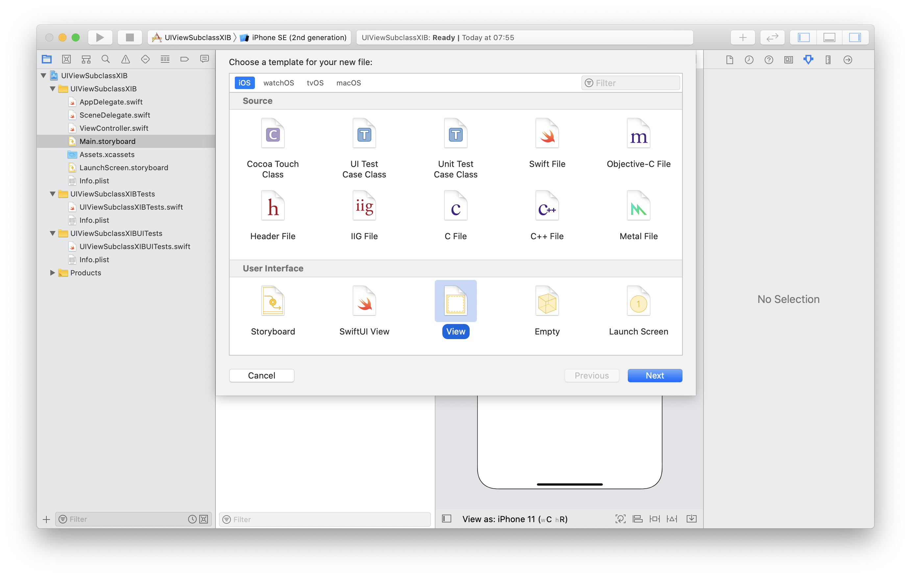
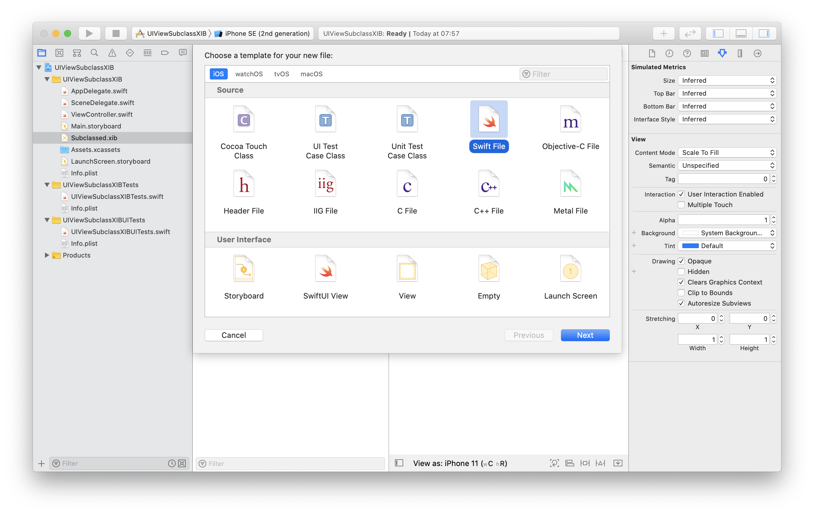
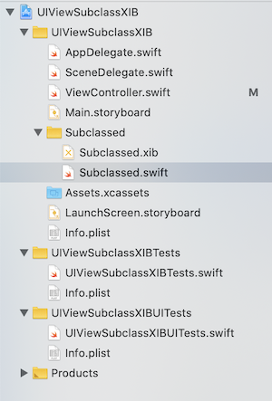
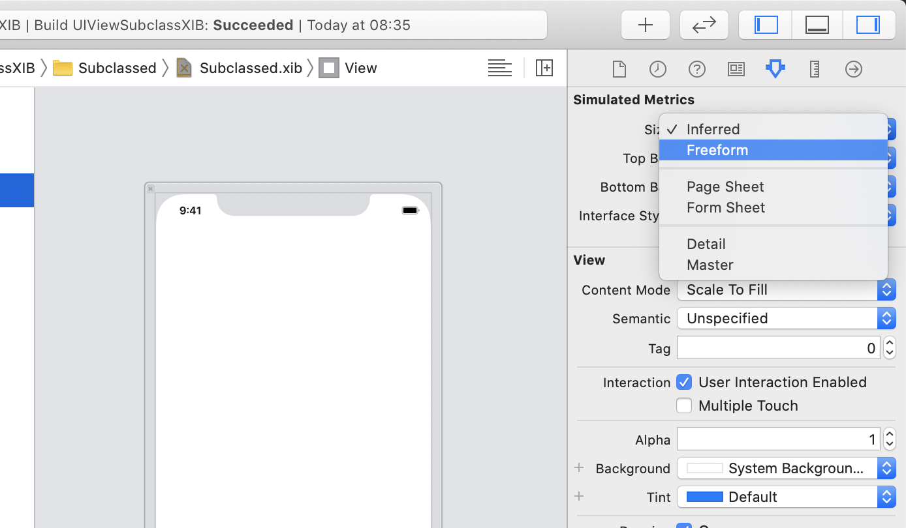
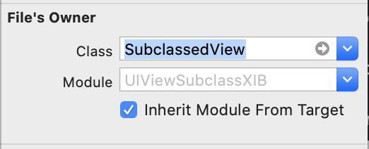
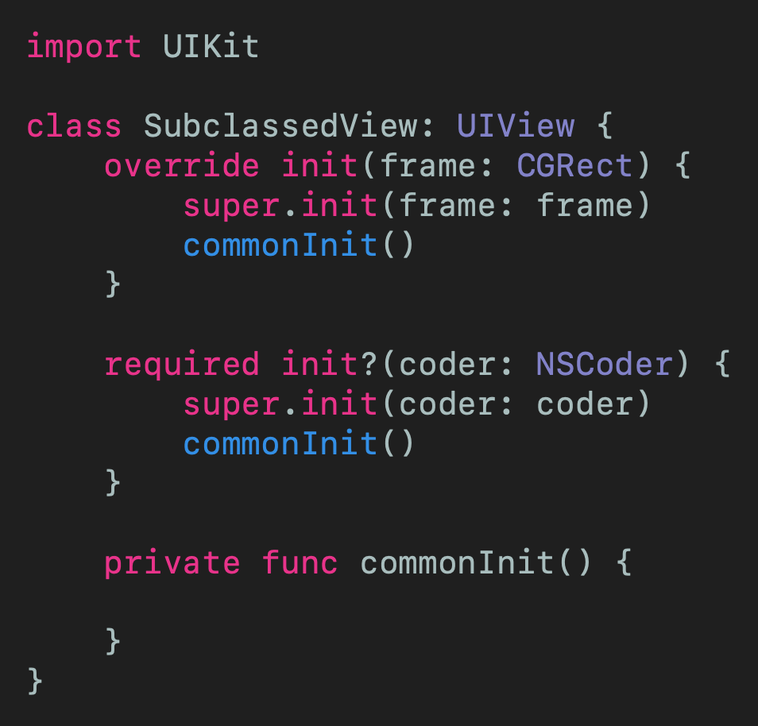
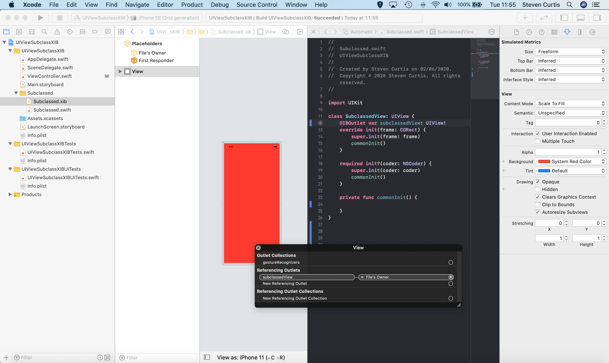
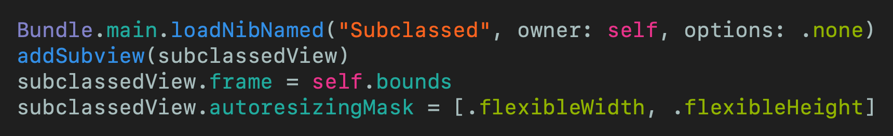

# Using a XIB File with a UIView Subclass
## Mix programmatic and storyboard interfaces

 
Photo by Jamie Street on Unsplash

I've written tutorials on various topics [subclassing `UIView`](https://medium.com/@stevenpcurtis.sc/subclassing-uiview-in-swift-d372c67b7f3) where we can programmatically create a subclassed `UIView` (and one of the main reasons to do this is when you override draw rect, but that's another discussion). In that article, I created the UIView programmatically; so what if you wish to use the *storyboard* to create the `UIView`?

Roll on the next article!

Difficulty: Beginner | **Easy** | Normal | Challenging
This article has been developed using Xcode 11.4.1, and Swift 5.2.2

## Prerequisites: 
* You will be expected to be aware how to make a [Single View Application](https://medium.com/swlh/your-first-ios-application-using-xcode-9983cf6efb71) in Swift.
* Some knowledge of [subclassing `UIView`](https://medium.com/@stevenpcurtis.sc/subclassing-uiview-in-swift-d372c67b7f3) would be useful, and give this article some context.

## Terminology
Storyboard: A visual representation of the User Interface of an Application
UIView: An object that manages the content for a rectangular area on the screen

# The step-by-step
I'm going to create two files - one will be the `XIB` file and one will be the programatic `.swift` file which need to be linked and instantiated from the main `UIViewController`.

## Creating the files
Due to a lack of creativity, I'm going to call my files `SubclassedView` - Awesome right! Right?

### Creating the XIB file
At the top menu, we can choose File>New>File (or choose ⌘-N)
In the following Window choose **View**
 
Name the file  `SubclassedView.xib` 

### Creating the swift file
At the top menu, we can choose File>New>File (or choose ⌘-N)
In the following Window choose **Swift File**
 
Name the file  `SubclassedView.swift` 

### Optionally: Create a nice group
Wouldn't it be nice to find these two files later? We can create a `group` in Xcode. As in the Mac finder, select the files `SubclassedView.xib` and `SubclassedView.swift` (perhaps using Shift) and then select new group from selection
 
I then chose to name my group subclassed, giving a project inspector that shows the following 
 
 
## Link the XIB and Swift files
### Setup the XIB file
#### Reset the size of the view
By default Xcode assumes that a `UIView` will be displayed on the device rather than any other container. This isn't true in this case - we want to display it with a fixed width and height. To do so we can select **Simulated Size** 

 
#### Optional: Reset the size of the view visibly in the XIB view
If you choose to do so, you can drag and drop the corner of the view to change the size, although this isn't mandatory. 

#### Optional: Reset the size of the view visibly in the XIB view
While we are here, we can change the background colour of the view to make sure we know that the XIB file is used. 
 

#### Change File's Owner 
Then we select the **File's Owner** in the top-left hand corner of the view 
 
We then select the **File's Owner** as our new `SubclassedView` 
 

#### The basic  code for the view
The file `SubclassedView.swift` file needs some minimal code to get us going. What does it look like? It's something like 
 
Ok, actually exactly like that.

## Place the subclass on the storyboard
You can programmatically place the subclass on the storyboard, now usually I'd direct you to something like [this tutorial](https://medium.com/@stevenpcurtis.sc/write-clean-code-by-overriding-loadview-ac4f172163d0) but in this case I'm going to simply give you the code, with constraints to place the subview into the center of the Storyboard with a fixed width and height. 

## Add an outlet for the view 
This is covered in my article [Outlet tutorial](https://medium.com/@stevenpcurtis.sc/connect-storyboard-objects-to-code-4105f9b99bba), so go there for the detailed explanation but suffice to say you drop a `UIView` onto the storyboard and then Control-Drag back onto the Storyboard. I've named mine `subclassedView` and I suggest you do the same. Nicely done! 
The end result looks like the following: 
 

## Finish the code
This isn't yet finished - there is some more required code to link the XIB file and the Swift file. Remember that my Swift file is called `Subclassed` and we need to tell Swift to look for that file (If you've named your file as something else you will need to adjust your code accordingly). 
 

Which I've placed into my attractively named `commonInit` function.

To make this clear, why don't I give you the complete code so you can see everything for yourself in one file?

 

# Conclusion

The assumption is that often if you are subclassing a UIView that you will create the interface programatically. This isn't always true, and perhaps you have good reason for using a XIB file in conjunction with your subclass. 
With that in mind, I hope this guide has helped you understand a little how you might go through this process and resolve any queries you might have. Further queries? If you've any questions, comments or suggestions please hit me up on [Twitter](https://twitter.com/stevenpcurtis) 
