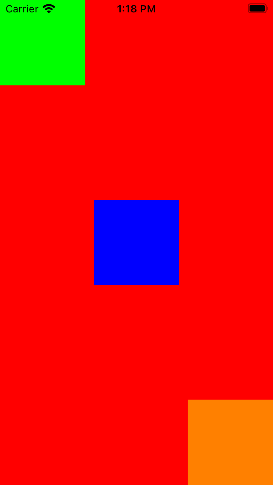
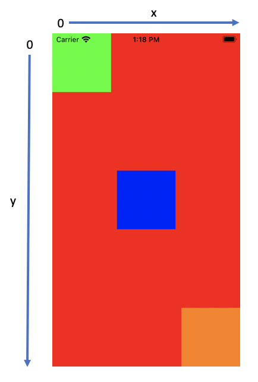
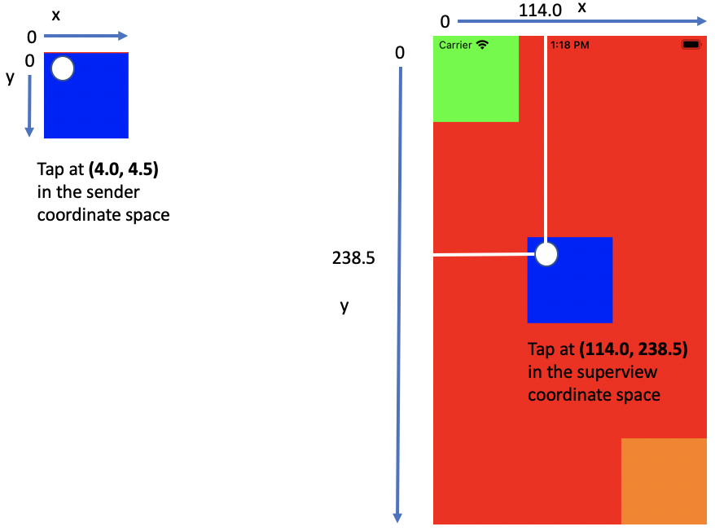
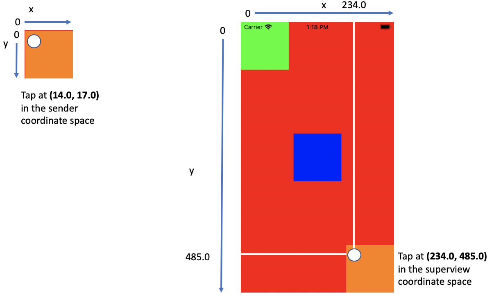

# Understanding Swift's ConvertPoint
## Which coordinate system are you in?

# Before we start
Difficulty: Beginner | Easy | **Normal** | Challenging<br/>


## Keywords and Terminology:
Bounds: Used in a Custom UIView to represent the drawing space’s origin and size
Frame: A rectangle in a superview’s coordinate space that contains the view’s bounds.size in it’s entirety 

## Prerequisites:
* You need to be able to create a basic Swift App. The example application I've built is created programmatically

# The example App
This has been created programmatically, and essentially is three `UIView` instances placed on a plain background. Please be aware that I've set the background as red to attempt to make it as easy as possible to see the two views on top of it.

I've created the three views as lazy vas. These have separate colours as follows - 
`view1`: blue
`view2`: green
`view3`: orange

and essentially each view is the same, but here are the details for the first view:

```swift
lazy var view1: UIView = {
    // setup `UIView` instance
    let view = UIView()
    // set the colour
    view.backgroundColor = .blue
    // let me take care of the layout
    view.translatesAutoresizingMaskIntoConstraints = false
    // create a `UITapGestureRecognizer` - the target is ViewController, and the function to be run is the tap function defined in this class
    let touch = UITapGestureRecognizer(target: self, action: #selector(tap(sender:)))
    // add the gesture to this view
    view.addGestureRecognizer(touch)
    // return this view
    return view
}()
```

where the gesture recognizer is set up as follows, but more on the content of this function later!

```swift
@objc func tap(sender: UITapGestureRecognizer) { }
```

of course we need to deal with the lifecycle of the `UIViewController`, and I've chosen to use `viewDidLoad()` to do the majority of the work setting up the view, while `loadView` of course sets up the background `UIView`.

```swift
override func loadView() {
    let view = UIView()
    view.backgroundColor = .red
    self.view = view
}

    override func viewDidLoad() {
    super.viewDidLoad()
    setupViews()
    setupConstraints()
}

func setupViews() {
    self.view.addSubview(view1)
    self.view.addSubview(view2)
    self.view.addSubview(view3)
}

func setupConstraints() {
    NSLayoutConstraint.activate([
        view1.centerYAnchor.constraint(equalTo: self.view.centerYAnchor),
        view1.centerXAnchor.constraint(equalTo: self.view.centerXAnchor),
        view1.heightAnchor.constraint(equalToConstant: 100),
        view1.widthAnchor.constraint(equalToConstant: 100),
        view2.leadingAnchor.constraint(equalTo: self.view.leadingAnchor),
        view2.topAnchor.constraint(equalTo: self.view.topAnchor),
        view2.heightAnchor.constraint(equalToConstant: 100),
        view2.widthAnchor.constraint(equalToConstant: 100),
        view3.trailingAnchor.constraint(equalTo: self.view.trailingAnchor),
        view3.bottomAnchor.constraint(equalTo: self.view.bottomAnchor),
        view3.heightAnchor.constraint(equalToConstant: 100),
        view3.widthAnchor.constraint(equalToConstant: 100)
    ])
}
```

## Bounds or Frame?
There are elements of this article that bear repetition. One part of this is thinking about whether we are in the view or the parent view's coordinate system. We can define this as follows:
Bounds: in the view's coordinate system
Frame: Parent's coordinate system

## Making it all clear.
If we tap on any of the `UIView` instances on the `UIViewController` called ViewController, it will print out interpretations of the point that has been pressed. This looks like the following:

```swift
@objc func tap(sender: UITapGestureRecognizer) {
    print (sender.location(in: sender.view))
    print (sender.location(in: self.view))
}
```

So in the case of the first `UIView`, that is the one in the top-left hand corner the `origin` of both the view (from the perspective of the tap function, this is the `sender.view` property is (0,0), and we can see by using the App this is indeed true.

The view happens to be a 100 square, so a tap in the bottom-right hand corner of the square will reveal the tap to be (100,100) in both coordinate spaces.

Now the iOS SDK is extremely generous towards us, in giving us `func location(in view: UIView?) -> CGPoint` which translates the tap into whichever coordinate space we would like. However, sometimes we would want to understand a point in another coordinate space, and this may not be a tap. In this case, we can convert a view into another coordinate space using the function `func convert(_ point: CGPoint, to view: UIView?) -> CGPoint`. In our case, we can add a new print statement to our `UITapGestureRecognizer`:

```swift
@objc func tap(sender: UITapGestureRecognizer) {
    print (sender.location(in: sender.view))
    print (sender.location(in: self.view))
    print( self.view.convert(sender.location(in: self.view), to: sender.view) )
}
```

however, this will return the same point as the location in the sender view. 
For the example of the green square in fact, all there logged statements will be the same. 

So we need to press on with further examples.

**The blue example**
If you are using the App from the repo, if you click towards the top-left hand corner of the blue square you might get something approaching the following console output:

```swift
(4.0, 4.5)
(114.0, 238.5)
(4.0, 4.5)
```

In the blue `UIView` itself we are tapping at (4.0, 4.5) (which is the first console output line), but the second shows that we are tapping on (114.9, 238.5) in the superview coordinate space - as represented by the white lines on the image below:



as before, the first location is in the coordinate space of the tap can be converted to the superview coordinate space using `func location(in view: UIView?) -> CGPoint` which gives us the same result: (114.0, 238.5).

**The green example**
The green `UIView` is pinned to the bottom-right of the superview. Essentially there isn't any difference between this example and the previous (where the blue `UIView` was pinned to the middle of the screen). 

Again a tap to the top-right hand corner of the orange `UIView`

```swift
(14.0, 17.0)
(234.0, 485.0)
(14.0, 17.0)
```



With the same as above applying!

# Conclusion
If you've any questions, comments or suggestions please hit me up on [Twitter](https://twitter.com/stevenpcurtis)
