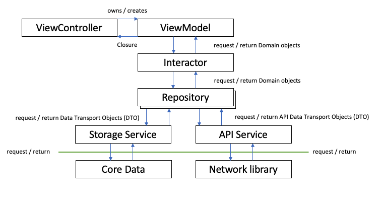

# Use the Decorator Pattern for Repository Caching and Cache Invalidation
## In Swift, naturally

I've an [example architecture](https://github.com/stevencurtis/DeezerMVVMArchitectureExample) that I've used for a while in these tutorials and for *other* uses. I quite like it as it conforms to the [solid principles](https://stevenpcurtis.medium.com/the-solid-principle-applied-to-swift-974e29b94d23) (more or less).

However, there is one thing that this architecture does not handle *at all*. It's using a cache. I've used implementations of caching where placing the class in the code has been an afterthought and caused issues in the code, and that's not good. Surely I can do better?

Difficulty: Beginner | Easy | Normal | Challenging | *Hard*

This article has been developed using Xcode 14.2, and Swift 5.7.2
- There are only two hard problems in computer science. Namely they are: Naming things and Cache invalidation

# Prerequisites:
- You will be expected to be aware how to make a [Single View Application](https://medium.com/swlh/your-first-ios-application-using-xcode-9983cf6efb71) in Swift.
- It might be worth looking over my [architecture example](https://medium.com/r/?url=https%3A%2F%2Fgithub.com%2Fstevencurtis%2FDeezerMVVMArchitectureExample), but don't worry. I'll cover the usage here.
- You might want to look at my [decorator pattern](https://medium.com/r/?url=https%3A%2F%2Fstevenpcurtis.medium.com%2Fthe-decorator-design-pattern-in-swift-4049b7656a0) in Swift example. Although I actually prefer the example here!

# Terminology
SOLID: a mnemonic acronym for five design principles intended to make software designs more understandable

# The issue
Repositories in this architecture work well.Looking at the diagram:



We request something from a repository and don't need to know if the data is returned from an API endpoint or a persistent storage.

```swift
final class BrowseRepository {
    private let apiService: BrowseApiServiceProtocol
    private let storageService: FavouritesStorageServiceProtocol

    init(
        apiService: BrowseApiServiceProtocol = BrowseApiService(),
        storageService: FavouritesStorageServiceProtocol = FavouritesStorageService()
    ) {
        self.apiService = apiService
        self.storageService = storageService
    }
}
```

Our BrowseRepository uses composition to combine an apiService and a storageService (both of which are behind a protocol / interface).
The interface (simplified from the example) could look something like this

```swift
protocol BrowseRepositoryProtocol {
    func getTracks() -> [Track]
    func deleteTrack(track: Track, completion: (() -> Void)?)
    getAlbumTracklist(urlString: String, completion: @escaping (Result<[Track], Error>) -> Void)
}
```

We use functions to (say) delete a favorite track and we do not need to know the implementation details of how or where that track is stored

```swift
extension BrowseRepository: BrowseRepositoryProtocol {
    func deleteTrack(track: Track, completion: (() -> Void)?) {
        storageService.delete(track: updateApiDtoFavouriteFrom(favourite: track), completion: completion)
    }

    ...
```

Although I don't have the code in this particular example, it is easy to imagine trying to get a track from the favourites in storage and if it does not exist download it from the API. The implementation details are handled by the repository class.

# Cache Invalidation

We could implement a cache and when we getTracks from the API we might want to invalidate out entire AlbumTracklist (which would be stored in the cache).
Where should that cache invalidation be performed, and where should we store the cache for this?

# How to cache: Ideas
## Add to the repository class

A cache in a repository is a convenient place since we get our model objects from the repository. The cache can act as a single source of truth for the repository, meaning that the repository contains the caching code. 

*But does this violate the single responsibility principle?*

The argument is that the repositories have the responsibility to manage persistent state. Caching is not part of this responsibility.

## Add caching to the application
The  consuming application is the one that knows whether it will accept a stale value or not in exchange for performance.

This can be handled by a separate class, a CacheInteractor that can be passed into classes which need to manage (or use) the cache.

This has the advantage that slices of data can be stored in a cache (filters and the like) which can then be used in various screens in the application.

```swift
protocol CachedDataInteractorProtocol {
    func fetchData(completion: @escaping ([String]) -> Void)
    func storeData(data: [String])
}

final class CachedDataInteractor: CachedDataInteractorProtocol {
    private let cache = NSCache<NSString, NSArray>()
    static let shared = CachedDataInteractor()

    private init() {}
    func fetchData(completion: @escaping ([String]) -> Void) {
        if let cacheData = cache.object(forKey: "repository_data") as? [String] {
            completion(cacheData)
        } else {
            completion([])
        }
    }

    func storeData(data: [String]) {
        self?.cache.setObject(data as NSArray, forKey: "repository_data")
    }
}
```

To invalidate this particular Interactor we can simply remove any reference to it! This is a trick I've used in production before.


## Add caching to repository using the decorator pattern

The repository has no business knowing that the data is being cached. If the data is in the cache it can be returned from the repository.

This idea states that caching is an *implementation detail* of a repository.

The cache itself should be hidden behind a protocol (interface).

Something like the following would suffice

```swift
protocol Repository {
    func fetchData(completion: @escaping ([String]) -> Void)
}

class NetworkRepository: Repository {
    func fetchData(completion: @escaping ([String]) -> Void) {
        // Perform network request to fetch data
        let data = ["Data 1", "Data 2", "Data 3"]
        completion(data)
    }
}

class CachedRepository: Repository {
    private let repository: Repository
    private let cache = NSCache<NSString, NSArray>()
    
    init(
         repository: Repository,
         cache:NSCache = NSCache<NSString, NSArray>()
    ) {
        self.repository = repository
        self.cache = cache
    }
    
    func fetchData(completion: @escaping ([String]) -> Void) {
        if let cacheData = cache.object(forKey: "repository_data") as? [String] {
            completion(cacheData)
        } else {
            repository.fetchData { [weak self] data in
                self?.cache.setObject(data as NSArray, forKey: "repository_data")
                completion(data)
            }
        }
    }
}
```

# How to Invalidate caches: Ideas
## Cache within the repository class
**Invalidate from the Application**

The repository should manage the persistent state of the entity. The consuming application knows whether a state value is appropriate and / or performance is paramount.
Using the technique described above, we don't need to leak implementation details about the cache.
I'm thinking something like the following:

```swift
final class CachedInteractor {

    var value: [Int] = 0
    var valuePublisher: AnyPublisher<[Int], Never> {
        $value
          .eraseToAnyPublisher()
    }

    static let shared = CachedInteractor()

    private init() {}

    func publishProperties(_ cachedValues: [Int]) {
        value = cachedValues
    }
}
```

**Invalidate from the Repository**

A invalidate() function will need to be exposed to the rest of the application, and implements the cache invalidation. This exposes that cache invalidation (and indeed the cache) is performed by the repository and leaks implementation details.

If you simply create a *time-based cache* you might do something like the following:

```swift
class InvalidatingCachedRepository: Repository {
    private let repository: Repository
    private let cache = NSCache<NSString, NSArray>()
    private var timer: Timer?
    
    init(repository: Repository) {
        self.repository = repository
    }
    
    func fetchData(completion: @escaping ([String]) -> Void) {
        if let cacheData = cache.object(forKey: "repository_data") as? [String] {
            completion(cacheData)
            timer = Timer.scheduledTimer(withTimeInterval: 30, repeats: false) { [weak self] _ in
                self?.cache.removeObject(forKey: "repository_data")
            }
        } else {
            repository.fetchData { [weak self] data in
                self?.cache.setObject(data as NSArray, forKey: "repository_data")
                completion(data)
            }
        }
    }
}
```

Which could then be called with something like

```swift
let networkRepository = NetworkRepository()
let cachedRepository = CachedRepository(networkRepository)
let invalidatingCachedRepository = InvalidatingCachedRepository(cachedRepository)

invalidatingCachedRepository.fetchData { data in
    print(data)
}
```

# Conclusion
This is an article with almost more questions than answers. If I'm pushed to make a decision, at the moment I'm thinking the invalidation should come from the App as the business logic knows when it should fetch new data rather than the repo itself. There again, I've a specific case in mind so I guess the answer is:

It depends.

[Sorry about that]

I hope this article has been of help for you and made things a little more real for you as you move forward in your development career!
