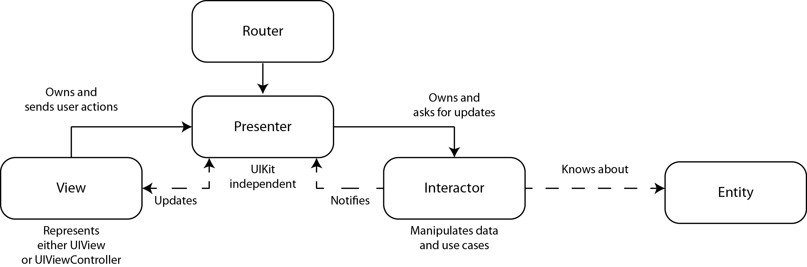

# Implement the Clean VIPER Architecture in iOS
## Learn how to implement the architecture!


<br/>
<sub>Photo by Captureson Photography on Unsplash<sub>

Difficulty: Beginner | Easy | **Normal** | Challenging<br/>
This article has been developed using Xcode 11.5, and Swift 5.2.4

I've previously written an [article](https://medium.com/swift-coding/the-viper-architecture-1a9dc140c505) explaining the use of VIPER for iOS applications. That particular article lacked one thing - a full example of the architecture and how we might traverse from one view to another and correctly inject dependencies. We can put that right now! 

In steps this article to describe the *implementation* of the article using Swift. Let's get started!


## Prerequisites: 
* You will be expected to be aware how to make a [Single View Application](https://medium.com/swlh/your-first-ios-application-using-xcode-9983cf6efb71) in Swift.
* The implementation takes adavantage of my network code [Single View Application](https://github.com/stevencurtis/SwiftCoding/tree/master/NetworkManager), and you may choose to look through that to understand what is going on with the netwroking here

## What this article is, and what it isn't 
One of the main disadvantages touted surrounding the VIPER architecture is that the communication between objects can become confusing and feel rather confusing. 

This implementation will cover a very clean case of the *VIPER* architecture to give you something to work with and build your own Apps on top of. 
That is, we are building a concrete example representing the following 

I've set about testing all of the code for the `UITableView` but I've left the `DetailView` section as an exercies for the reader. 

There are some force-unwraps in the tests - this isn't an accident and I tend to do this for non-production code. You may choose to write your code differently. 

The code calls ""https://jsonplaceholder.typicode.com/photos"" for the main tableview, and then draws images from the JSON String returned. This particular code does not use my [API manager](https://medium.com/swlh/building-urls-in-swift-51f21240c537) and might have been better had it done so, but this code is not production ready.

# The setup
The `SceneDelegate` sets the stage for our VIPER implementation. In this case, we have used a `UINavigationController` to hold together our code.
```swift
func scene(_ scene: UIScene, willConnectTo session: UISceneSession, options connectionOptions: UIScene.ConnectionOptions) {
        guard let windowScene = (scene as? UIWindowScene) else { return }
        window = UIWindow(frame: windowScene.coordinateSpace.bounds)
        window?.windowScene = windowScene

        let vc = TableViewController()
        let rootNC = UINavigationController(rootViewController: vc)
        
        self.window?.rootViewController = rootNC
        
        window?.makeKeyAndVisible()
}
```

# The VIPER
The **entitiy** is perhaps the easier component of VIPER, and gives us the following
```swift
struct Photo: Decodable, Equatable {
    let albumId: Int
    let id: Int
    let title: String
    let url: String
    let thumbnailUrl: String
}
```

which conforms to the [decodable protocol](https://medium.com/@stevenpcurtis.sc/decode-json-with-swift-and-test-it-e2d26dfafd6d) and [equatable](https://medium.com/@stevenpcurtis.sc/swifts-equatable-and-comparable-protocols-54811114a5cf).

The **wireframe** conforms to a protocol and sets up the view controller and it's dependencies.

```swift 
protocol TableViewWireframeProtocol {
    func moveToDetail(view: TableViewControllerProtocol, withURL url: URL)
}

class TableViewWireframe: TableViewWireframeProtocol {
    func moveToDetail(view: TableViewControllerProtocol, withURL url: URL) {
        let detailViewController = DetailViewController()
        detailViewController.url = url
        DetailViewWireframe.createDetailModule(view: detailViewController)
        view.navigationController?.pushViewController(detailViewController, animated: true)
    }
    
    static func createViewModule (view: TableViewController) {
        let presenterInst = TableViewPresenter()
        view.presenter = presenterInst
        view.presenter?.wireframe = TableViewWireframe()
        view.presenter?.view = view
        view.presenter?.interactor = TableViewInteractor()
        view.presenter?.interactor?.presenter = presenterInst
    }
}
```

designing each class to it's interface [protocol](https://medium.com/@stevenpcurtis.sc/protocols-in-swift-f46c31283b18) which allows mocks to be formed (more on this later).

We create the *TableViewController** which conforms to it's own protocol

```swift
protocol TableViewControllerProtocol {
    func refresh()
    var navigationController: UINavigationController? { get }
}

class TableViewController: UIViewController, TableViewControllerProtocol {
    
    var presenter: TableViewPresenter?
    let table = UITableView()
    
    init() {
        super.init(nibName: nil, bundle: nil)
        TableViewWireframe.createViewModule(view: self)
    }
    
    required init?(coder: NSCoder) {
        fatalError("init(coder:) has not been implemented")
    }
    
    override func viewDidLoad() {
        super.viewDidLoad()
        self.view.backgroundColor = .blue
        
        setupTable()
        setupConstraints()
        
        presenter?.loadData()
    }
    
    func refresh() {
        table.reloadData()
    }
    
    override func viewWillAppear(_ animated: Bool) {
    }
    
    func setupTable() {
        table.delegate = self
        table.dataSource = self
        
        table.register(UITableViewCell.self, forCellReuseIdentifier: "cell")
        
        table.backgroundColor = .white
        table.translatesAutoresizingMaskIntoConstraints = false
        self.view.addSubview(table)
    }
    
    func setupConstraints() {
        NSLayoutConstraint.activate([
            table.topAnchor.constraint(equalTo: self.view.topAnchor),
            table.bottomAnchor.constraint(equalTo: self.view.bottomAnchor),
            table.leadingAnchor.constraint(equalTo: self.view.leadingAnchor),
            table.trailingAnchor.constraint(equalTo: self.view.trailingAnchor)
        ])
    }
}

extension TableViewController: UITableViewDelegate {
    func tableView(_ tableView: UITableView, didSelectRowAt indexPath: IndexPath) {
        presenter?.moveToDetail(indexPath: indexPath)
        tableView.deselectRow(at: indexPath, animated: true)
    }
}

extension TableViewController: UITableViewDataSource {
    func tableView(_ tableView: UITableView, numberOfRowsInSection section: Int) -> Int {
        return presenter?.photos.count ?? 0
    }
    
    func tableView(_ tableView: UITableView, cellForRowAt indexPath: IndexPath) -> UITableViewCell {
        let cell = tableView.dequeueReusableCell(withIdentifier: "cell", for: indexPath)
        cell.textLabel?.text = presenter?.photos[indexPath.row].title
        cell.textLabel?.numberOfLines = 0
        return cell
    }
}
```

The **presenter** presents the data for easy display by the dumb viewcontroller

```swift
protocol TableViewPresenterProtocol: class {
    func moveToDetail(indexPath: IndexPath)
    func loadData()
    func dataDidFetch(photos: [Photo])
}
class TableViewPresenter: TableViewPresenterProtocol {
    
    var wireframe: TableViewWireframeProtocol?
    var view: TableViewControllerProtocol?
    var interactor: TableViewInteractorProtocol?

    var dataDownloaded = 0
    
    var photos: [Photo] = []
        
    func loadData() {
        interactor?.getData()
    }
        func dataDidFetch(photos: [Photo]) {
        self.photos = photos
        DispatchQueue.main.async {
            self.view?.refresh()
        }
    }
    
    func moveToDetail(indexPath: IndexPath) {
        if let view = view,
           let url = URL(string: photos[indexPath.row].url) {
            wireframe?.moveToDetail(view: view, withURL: url)
        }
    }
}
```

The **interactor** is the place where the network calls are made.

```swift
protocol TableViewInteractorProtocol {
    func getData()
    var presenter: TableViewPresenterProtocol? {set get}
}
class TableViewInteractor: TableViewInteractorProtocol {
    weak var presenter: TableViewPresenterProtocol?
    
    private var networkManager: AnyNetworkManager<URLSession>?
    
    convenience init() {
        self.init(networkManager: NetworkManager<URLSession>() )
    }
    
    required init<T: NetworkManagerProtocol>(networkManager: T) {
        self.networkManager = AnyNetworkManager(manager: networkManager)
    }
func getData() {
        if let url = URL(string: "https://jsonplaceholder.typicode.com/photos") {
            self.networkManager?.fetch(url: url, method: .get, completionBlock: {result in
                switch result {
                case .failure(let error):
                    // this error should be communicated with the user
                    print (error)
                case .success(let data):
                    let decoder = JSONDecoder()
                    let decoded = try! decoder.decode([Photo].self, from: data)
                    self.presenter?.dataDidFetch(photos: decoded)
                }
            })
        }
    }
}
```

So how can this be tested?

# The Testing

Using Mocks is really important in swapping out the real (for example interactor).

**MockTableViewPresenter**
```swift
class MockTableViewPresenter: TableViewPresenterProtocol {
    var didfetch: (()->())?
    func loadData() {}
    
    func dataDidFetch(photos: [Photo]) {
        if let didFetch = didfetch {
            didFetch()
        }
    }
    
    func moveToDetail(indexPath: IndexPath) { }
}
```

**MockView**
```swift
class MockView: TableViewControllerProtocol {
    var didRefresh: (()->())?
    func refresh() {
        if let didRefresh = didRefresh {
            didRefresh()
        }
    }
    
    var navigationController: UINavigationController?
}
```

**MockTableViewWireframe**
```swift
class MockTableViewWireframe: TableViewWireframeProtocol {
    var moveToDetail: URL?
    func moveToDetail(view: TableViewControllerProtocol, withURL url: URL) {
         moveToDetail = url
    }
    
    var requestMoveToURL: URL?
    func moveToDetail(view: UIViewController, withURL url: URL) {
        requestMoveToURL = url
    }
}
```

**MockTableViewInteractor**
```swift
class MockTableViewInteractor: TableViewInteractorProtocol {
    var presenter: TableViewPresenterProtocol?
    
    var dataRequested = false
    func getData() {
        dataRequested = true
    }
}
```

which then lets us write the following tests
**TableViewInteractorTests**
```swift
    let mockPresenter: TableViewPresenterProtocol = MockTableViewPresenter()
    
    func testInteractor() {
        let expectation = XCTestExpectation(description: #function)
        let networkManager = MockNetworkManager(session: URLSession.shared)
        networkManager.outputData = photosString.data(using: .utf8)
        let interactor = TableViewInteractor(networkManager: networkManager)
        interactor.presenter = mockPresenter
        (mockPresenter as? MockTableViewPresenter)?.didfetch = {
            expectation.fulfill()
        }
        interactor.getData()
        wait(for: [expectation], timeout: 2.0)
    }
```

**TableViewPresenterTests**
```swift
    let photo = Photo(albumId: 1, id: 1, title: "test", url: "testurl", thumbnailUrl: "thumbURL")
    
        func testMove() {
        let presenter = TableViewPresenter()
        let wireframe: TableViewWireframeProtocol = MockTableViewWireframe()
        presenter.photos = [photo]
        let indexPath = IndexPath(row: 0, section: 0)
        presenter.wireframe = wireframe
        presenter.view = MockView()
        presenter.moveToDetail(indexPath: indexPath)
        XCTAssertEqual((wireframe as! MockTableViewWireframe).requestMoveToURL, nil)
    }
    
        func testPresenterDidFetch() {
        let presenter = TableViewPresenter()
        let interactor: TableViewInteractorProtocol = MockTableViewInteractor()
        presenter.interactor = interactor
        presenter.dataDidFetch(photos: [photo])
        XCTAssertEqual(presenter.photos, [photo])
    }
    
        func testPresenter() {
        let presenter = TableViewPresenter()
        let interactor: TableViewInteractorProtocol = MockTableViewInteractor()
        presenter.interactor = interactor
        presenter.loadData()
        XCTAssertEqual( (interactor as! MockTableViewInteractor).dataRequested, true)
    }
```

# Advantages
VIPER makes it easier to test code - by making a modular solution for your App. The architecture should help you to enformce the single responsibility principle and help to reduce the load on view controllers.

# Disadvantages
Communication between objects can be convoluted and complicated. Without care, modules can become too large and do too many things. Potentially some implementation of VIPER violate the single responsibility principle!

# Conclusion

VIPER isn't all that difficult!

However it seems to have fallen a little bit out of fashion recently.

If you've any questions, comments or suggestions please hit me up on [Twitter](https://twitter.com/stevenpcurtis) 
