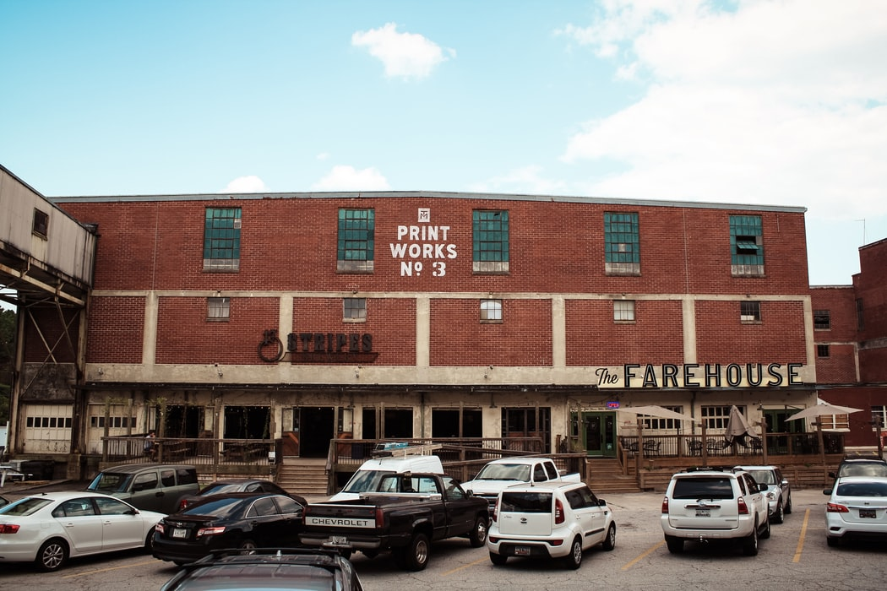

## Encode Behaviors into Reusable View Controllers
# Using the American spelling


<sub>Photo by Jonathan Hanna</sub>

Difficulty: Beginner | Easy | Normal | Challenging<br/>
This article has been developed using Xcode 12.1, and Swift 5.3

## Prerequisites:
* You will be expected to be aware how to make a [Single View Application](https://medium.com/swlh/your-first-ios-application-using-xcode-9983cf6efb71) in Swift.
* The solution involves the use of Swift's [protocols](https://medium.com/@stevenpcurtis.sc/protocols-in-swift-f46c31283b18) and [extending protocols](https://medium.com/@stevenpcurtis.sc/protocol-extensions-in-swift-3c8b1127701e)
* This article assumes knowledge of the [UIViewController lifecycle](https://medium.com/@stevenpcurtis.sc/the-uiviewcontroller-lifecycle-b964cf18256b)

## Terminology
Extension: Extensions add new functionality to a class, struct, enum or protocol
Override: The process in which a subclass changes a method, property or type in the parent class
Protocol: A blueprint on methods, properties and requirements to suit a piece of functionality
UIViewController: A view controller is an intermediary between the views it manages and the data of your app

## Break down!
The principle here is that we are trying to break view controllers up - which essentially is attempting to make iOSs `UIViewControllers` more closely follow the [Single Responsibility Principle](https://stevenpcurtis.medium.com/the-solid-principle-applied-to-swift-974e29b94d23).

Now this is an article I've written to support  a blog post by [Soroush](https://khanlou.com/2016/02/many-controllers/) along with a similar post by [Bryan](https://irace.me/lifecycle-behaviors) - however I failed to follow either of these propertly for the appearance and suppression of the `UINavigationBar`, so this article covers that (so all credit goes to Soroush and Bryan).

## The example behaviour
Within this article we are going to hide the `UINavigationBar` in the first of two `UIViewController` instances within a `UINavigationController`. In order to do so this article will use the function

```swift
func setNavigationBarHidden(_ hidden: Bool, animated: Bool)
```

(we shall see that concrete implementation later).

## The solution
We are using Swift, so it makes sense that we would want to use [protocols](https://medium.com/@stevenpcurtis.sc/protocols-in-swift-f46c31283b18)

**The protocol**
It is possible to use any of any of the `UIViewController` [lifecycle events](https://medium.com/@stevenpcurtis.sc/the-uiviewcontroller-lifecycle-b964cf18256b) in order to implement these behaviours.

This protocol is called `ViewControllerLifecycleBehavior`:

```swift
protocol ViewControllerLifecycleBehavior {
    func viewDidLoad(viewController: UIViewController)
    func viewWillAppear(viewController: UIViewController)
    func viewDidAppear(viewController: UIViewController)
    func viewWillDisappear(viewController: UIViewController)
    func viewDidDisappear(viewController: UIViewController)
    func viewWillLayoutSubviews(viewController: UIViewController)
    func viewDidLayoutSubviews(viewController: UIViewController)
}
```

Now to prevent each behaviour needing to implement every single part of the lifecycle we can create default implementations within a [protocol extension](https://medium.com/@stevenpcurtis.sc/protocol-extensions-in-swift-3c8b1127701e)

```swift
extension ViewControllerLifecycleBehavior {
    func viewDidLoad(viewController: UIViewController) {}
    func viewWillAppear(viewController: UIViewController) {}
    func viewDidAppear(viewController: UIViewController) {}
    func viewWillDisappear(viewController: UIViewController) {}
    func viewDidDisappear(viewController: UIViewController) {}
    func viewWillLayoutSubviews(viewController: UIViewController) {}
    func viewDidLayoutSubviews(viewController: UIViewController) {}
}
```

Now rather than using a base class for a view controller, which I've previously claimed is [doing it wrong](https://stevenpcurtis.medium.com/if-youre-using-a-base-class-in-swift-you-re-doing-it-wrong-77c515f42684) instead we are going to use an extension on the `UIViewController` class and then implement a function to add behaviors into the `UIViewController` class. Unfortunately we are going to need to override `viewDidLoad()` and other lifecycle methods.

```swift
extension UIViewController {
    func addBehaviors(_ behaviors: [ViewControllerLifecycleBehavior]) {
        let behaviorViewController = LifecycleBehaviorViewController(behaviors: behaviors)
        addChild(behaviorViewController)
        view.addSubview(behaviorViewController.view)
        behaviorViewController.didMove(toParent: self)
    }

    private final class LifecycleBehaviorViewController: UIViewController, UIGestureRecognizerDelegate {
        private let behaviors: [ViewControllerLifecycleBehavior]
        init(behaviors: [ViewControllerLifecycleBehavior]) {
            self.behaviors = behaviors
            super.init(nibName: nil, bundle: nil)
        }

        required init?(coder aDecoder: NSCoder) {
            fatalError("init(coder:) has not been implemented")
        }

        override func viewDidLoad() {
            super.viewDidLoad()
            view.isHidden = true
            applyBehaviors { behavior, viewController in
                behavior.viewDidLoad(viewController: viewController)
            }
        }

        override func viewWillAppear(_ animated: Bool) {
            super.viewWillAppear(animated)
            applyBehaviors { behavior, viewController in
                behavior.viewWillAppear(viewController: viewController)
            }
        }

        override func viewDidAppear(_ animated: Bool) {
            super.viewDidAppear(animated)
            applyBehaviors { behavior, viewController in
                behavior.viewDidAppear(viewController: viewController)
            }
        }

        override func viewWillDisappear(_ animated: Bool) {
            super.viewWillDisappear(animated)
            applyBehaviors { behavior, viewController in
                behavior.viewWillDisappear(viewController: viewController)
            }
        }

        override func viewDidDisappear(_ animated: Bool) {
            super.viewDidDisappear(animated)
            applyBehaviors { behavior, viewController in
                behavior.viewDidDisappear(viewController: viewController)
            }
        }

        override func viewWillLayoutSubviews() {
            super.viewWillLayoutSubviews()
            applyBehaviors { behavior, viewController in
                behavior.viewWillLayoutSubviews(viewController: viewController)
            }
        }

        override func viewDidLayoutSubviews() {
            super.viewDidLayoutSubviews()
            applyBehaviors { behavior, viewController in
                behavior.viewDidLayoutSubviews(viewController: viewController)
            }
        }

        // MARK: - Private

        private func applyBehaviors(body: (_ behavior: ViewControllerLifecycleBehavior, _ viewController: UIViewController) -> Void) {
            guard let parent = parent else { return }
            for behavior in behaviors {
                body(behavior, parent)
            }
        }
    }
}
```

This can then be called in the `viewDidLoad()` method of the `ViewController` class.

```swift
class ViewController: UIViewController {
    override func viewDidLoad() {
        super.viewDidLoad()
        setupBehaviours()
    }
    
    private func setupBehaviours() {
        addBehaviors([HideNavigationBarBehavior()])
    }

    override func viewWillAppear(_ animated: Bool) {
        super.viewWillAppear(animated)
    }
}
```

## Other uses
This behavioural method is suitable for perhaps loading analytics, or changing the color of a `UINavigationBar`, making the back button empty on a `UINavigationBar` amongst other behaviours. Wonderful! 

# Conclusion
So we have found a way to avoid the use of big view controllers, or horrible base classes. 

I hope this article works as a companion to by [Soroush](https://khanlou.com/2016/02/many-controllers/) and [Bryan's work](https://irace.me/lifecycle-behaviors) while providing a full implementation for you to download from the [repo](https://github.com/stevencurtis/SwiftCoding/tree/master/ViewControllerLifecycleBehaviors). I hope this helps in any case.

If you've any questions, comments or suggestions please hit me up on [Twitter](https://twitter.com/stevenpcurtis) 