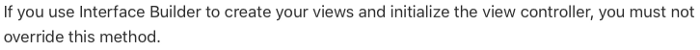
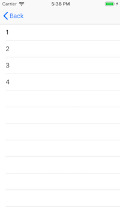

#  viewDidLoad() Vs. loadView()
## What do you think the difference is?

<br/>
<sub>Title Image<sub>

Difficulty: Beginner | **Easy** | Normal | Challenging

loadView() is a method managed by the view controller. But what does that mean and where is it used?

# Prerequisites:
Some familiarity with view controllers

# Terminology
View controller: An instance of UIViewController that managers a view hierarchy for an App.

# The problem
There seems to be some ambiguity when considering where to put your code between these methods.

Both are methods that you can override.

However, these are key differences which feel like they are buried within the documentation.

# The difference
## viewDidLoad()
This is called whether we programatically create the interface, or use do so with code.

This is usually used to perform additional initialization on views that are loaded from nib files.

So in practice we override viewDidLoad to perform initialization on views, for example setting the background color of the main self.view or other configuration of the objects.

## loadView()
This creates the view that the controller manages. Seems easy, but you can pick out one important sentence within the documentation:

<br/>

That is, loadView should only be used when you programatically instantiate your view controllers. In fact(as we shall see) it is a good fit for replacing a view

## So…
The choice between Storyboards and programatic views is a subjective one. Perhaps you decide to use programmatic views so people can work on the same part of the project without merge conflicts (and with accompanying simpler code reviews) or you feel that the development of your project is better suited to Storyboards so you can see everything related to your Storyboard. Either way, your use of methods within UIViewController are affected by your choice (or at least the use should be effected).

## In practice
Most of the initialization of the view controller will normally happen within the viewDidLoad() function. This is after all the views are in memory (so outlets are set) and we set colors, default placeholder text and other settings for the views.

For this example we create a simple tableview, and populate this with the simplest of strings — 1,2,3,4. I’ve avoided using complex architectures here so just have a simple “cram it in the VC approach”.

<br/>

Creating a view using a storyboard means setting your outlets and having an output similar to the following:

```swift
override func viewDidLoad() {
    super.viewDidLoad()
    tableView.delegate = self
    tableView.dataSource = self
    tableView.register(UITableViewCell.self, forCellReuseIdentifier: "cell")
}
```

And creating the same thing programatically can give the following

```swift
override func viewDidLoad() {
    super.viewDidLoad()
}
override func loadView() {
    let tv = UITableView()
    tv.backgroundColor = .white
    tv.register(UITableViewCell.self, forCellReuseIdentifier: "cell")
    tv.dataSource = self
    tv.delegate = self
    view = tv
    tableView = tv
}
```

## The Gotcha
The view will already be constrained to the edges of the View Controller. So for this there is no need for constraints to be added to the view; in fact if you do your added view may well have ambiguous constraints.

#The Repo link
There is a full example here:

https://github.com/stevencurtis/SwiftCoding/tree/master/ViewDidLoadLoadView