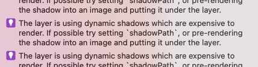
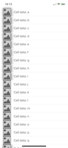

# Why Use LayoutSubviews Anyway?
## It works...

I previously wrote [an article about the view drawing cycle](https://medium.com/better-programming/demystifying-the-view-drawing-cycle-fb1f7ac519f1), yet this turned out to be insufficient when I needed some help with shadows in a `UITableViewCell` subclass. 

So I felt like more guidance should be out there around `layoutSubviews`. This article is the result of my investigation!

# Before we start
Difficulty: Beginner | **Easy** | Normal | Challenging<br>
This article has been developed using Xcode 12.5, and Swift 5.4

## Prerequisites
* You'll need to either be able to write [an iOS application](https://medium.com/swlh/your-first-ios-application-using-xcode-9983cf6efb71) or write some Swift code in [Playgrounds](https://medium.com/@stevenpcurtis.sc/coding-in-swift-playgrounds-1a5563efa089)

## Keywords and Terminology
layoutSubview: A function containing code called when the view is resized

# This article
## Background
The view lifecycle is extremely important especially while subclassing `UIView`. However I wanted to add shadows to my `UITableView`. What could possibly go wrong?

## The failed attempt

I set up a `UITableView` like in the following [example article](https://stevenpcurtis.medium.com/the-uitableview-example-54e6a804b919) and added a shadow around the `UIImageView` on the left-hand side.

At first I added the following when I wanted to dequeue and return the cell:

```swift
let cell = tableView.dequeueReusableCell(withIdentifier: "cell", for: indexPath)
cell.textLabel?.text = "Cell data: \(data[indexPath.row])"
cell.imageView?.layer.shadowRadius = 8
cell.imageView?.layer.shadowOffset = CGSize(width: 3, height: 3)
cell.imageView?.layer.shadowOpacity = 0.5
cell.imageView?.layer.cornerRadius = 20
cell.imageView?.image = UIImage(named: "PlaceholderImage")
return cell
```

This all seemed fine, but when moving to the [Visual Debugger]() there is a rather aggressive warning:



so the [standard solution](https://stevenpcurtis.medium.com/see-retain-cycles-in-xcode-70eb150ce7d1) is to add the following:

```swift
if let rect = cell.imageView?.bounds {
    cell.imageView?.layer.shadowPath = UIBezierPath(rect: rect).cgPath
 }
```

which leaves the following result


This - simply - cannot - be - the - right - way

 ## The solution
 Rather than using the `UIImageView` of the `UITableViewCell` class, we cam create our own `UITableViewCell` subclass to give access to `layoutSubviews()` and we are then able to set the shadow right there! 
 
 So our cell definition looks substantially different:
 
 ```swift 
 if let cell = tableView.dequeueReusableCell(withIdentifier: "cell", for: indexPath) as? CustomTableViewCell {
    cell.setupCell(data: data[indexPath.row], image: "PlaceholderImage" )
    return cell
}
fatalError()
 ```
 
 Where my personal style adds the [fatalError](https://medium.com/@stevenpcurtis.sc/precondition-assert-fatal-error-or-guard-in-your-swift-code-5f9297658be0) to avoid [force unwrapping](https://medium.com/@stevenpcurtis.sc/avoiding-force-unwrapping-in-swift-6dae252e970e) in the code.
 
 Then I've the following rather lovely `UITableViewCell` subclass. Note that I've added a property `shadowPathCache` and the shadow is drawn as a `UIBezierPath(rect: rect).cgPath` to develop a performant shadow.
 
 ```swift
 class CustomTableViewCell: UITableViewCell {
    
    /// A cache for the shadow path
    var shadowPathCache: CGPath?
    
    /// The image on the left-hand side of the UITableViewCell
    lazy var leftImage: UIImageView? = {
        let imgView = UIImageView()
        imgView.contentMode = .scaleAspectFit
        imgView.translatesAutoresizingMaskIntoConstraints = false
        return imgView
    }()

    override init(style: UITableViewCell.CellStyle, reuseIdentifier: String?) {
        super.init(style: style, reuseIdentifier: reuseIdentifier)
        addSubview(leftImage!)

        // do not setup AutoLayout according to the textLabel's autoresizing mask
        textLabel?.translatesAutoresizingMaskIntoConstraints = false
        
        NSLayoutConstraint.activate([
            textLabel!.topAnchor.constraint(equalTo: topAnchor),
            textLabel!.bottomAnchor.constraint(equalTo: bottomAnchor),
            textLabel!.leadingAnchor.constraint(lessThanOrEqualToSystemSpacingAfter: leftImage!.trailingAnchor, multiplier: 1),
            textLabel!.trailingAnchor.constraint(equalTo: trailingAnchor),
            leftImage!.topAnchor.constraint(equalTo: topAnchor),
            leftImage!.bottomAnchor.constraint(equalTo: bottomAnchor),
            leftImage!.leftAnchor.constraint(equalTo: leftAnchor),
            leftImage!.widthAnchor.constraint(equalTo: leftImage!.heightAnchor),
        ])
    }
    
    required init?(coder: NSCoder) {
        fatalError("init(coder:) has not been implemented")
    }
    
    func setupCell(data: String, image: String) {
        textLabel!.text = "Cell data: \(data)"
        leftImage!.image = UIImage(named: "PlaceholderImage")
    }
    
    // perform precise layout of the subviews by overriding layoutSubviews()
    override func layoutSubviews() {
        super.layoutSubviews()
        if let shadowPath = self.shadowPathCache {
            leftImage!.layer.shadowPath = shadowPath
        } else if let rect = leftImage?.bounds {
            self.shadowPathCache = UIBezierPath(rect: rect).cgPath
        }
        
        leftImage?.layer.shadowRadius = 8
        leftImage?.layer.shadowOffset = CGSize(width: 3, height: 3)
        leftImage?.layer.shadowOpacity = 0.5
    }
}
```
 
 ## Why layoutSubviews?
 The `layoutSubviews()` function can be overridden in order to set the frame rectangles of subviews. Now this is rather excellent because at any time the frame changes `layoutSubviews()` is called, and then the `shadowPath` can be changed to reflect the current size (if not it would still be at the old position, which would look awful.
 
 Not only that, views do not necessarily have the right size when they are first initialized. This means that if the `shadowPath` is set right after init, the `UIImageView` might not have the right frame size, and this would be wrong (as in, it would result in some of the `UITableViewCell` instances would end up without a shadow (which is not the type of UI look that you would like).
 
# Conclusion
Never mind the force unwraps, as I've a [guide to using and getting rid of those](https://medium.com/@stevenpcurtis.sc/avoiding-force-unwrapping-in-swift-6dae252e970e)

Of course initializing shadows isn't the only use of the `layoutSubview()` function -but this should give you an idea of how the function should be able to work to help you create your own rather wonderful applications.

If you've any questions, comments or suggestions please hit me up on [Twitter](https://twitter.com/stevenpcurtis) 
