# The Inspector Bar in Xcode
## Exploring Xcode 12

Difficulty: **Beginner** | Easy | Normal | Challenging 
This article has been developed using Xcode 12.5, and Swift 5.4

# Prerequisites:
* You will need to have downloaded and installed Xcode

# Terminology
Xcode: An IDE for the Mac that allows development of Mac and iOS software

# In Depth Xcode
## Seeing the Inspector Bar
Make sure that the right-pane of Xcode is visible, and you can do this by selecting the icon at the top-right hand corner of the Xcode interface. 

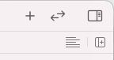 

Don't worry if you select this by accident and the right pane disappears, this is a toggle button so another press will bring the right-pane right back!

## Options While Coding
This applies to `.swift` files, `.plist` files, `.xcassets` and others. When you select such a file, you can choose from the following

**The File Inspector ⌥ - ⌘ - 1**
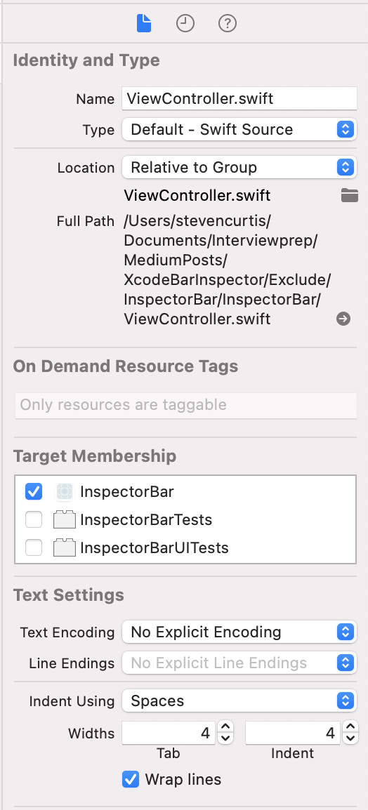 
Worthy of note is the target membership, this should generally be set to the current project (and test files set to the test target) - but get it wrong and the compiler won't be able to access your file. 

**History Inspector ⌥ - ⌘ - 2**
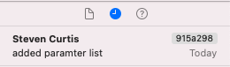 
This shows source control history, and is very useful particularly if you are using [Git Source control with Xcode](https://medium.com/swlh/using-git-source-control-with-xcode-227b4dfe5eb7)

**Quick Help ⌥ - ⌘ - 3**
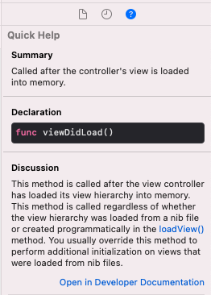 
Quick help is really useful if you select a function, like `viewDidLoad()` (in the screenshot I clicked on the function name). You then get a link to the developer documentation, which is always useful and gives you quick access to that all-important official documentation. 

## Options While Using The Storyboard
Arguably using the Storyboard is still coding, but that is rather a side issue as these inspectors are also available when you select the `LaunchScreen.storyboard` , or a NIB file. 
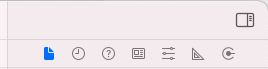 

**The File Inspector ⌥ - ⌘ - 1**
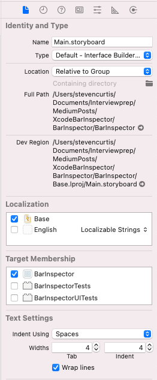 
Once again, this gives you options to select the target membership for the files, but also this gives us localization options (do you want to use Strings files attached to the storyboard or generalized Strings files)

**History Inspector ⌥ - ⌘ - 2**
 
This shows source control history, and is very useful particularly if you are using [Git Source control with Xcode](https://medium.com/swlh/using-git-source-control-with-xcode-227b4dfe5eb7)

**Quick Help ⌥ - ⌘ - 3**
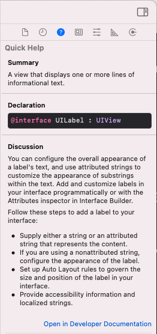 
When you drop elements onto the storyboard (or NIB file) Xcode gives you a summary of that component from the documentation). Awesome!

**Identity Inspector ⌥ - ⌘ - 4**
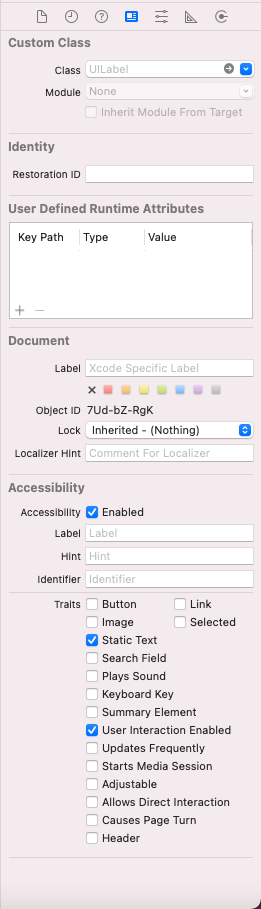 
This is an incredibly important inspector when you are creating your user interfaces using the Storyboard.
This is because, not only if you want to a subclass you need to select it in the inspector
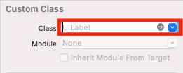 
Now similarly the Restoration ID can be set for State Restoration

**Attribute Inspector ⌥ - ⌘ - 5**
The attributes of your current object can be checked on the attributes inspector. There are a great deal of things that you can do here, depending on which Object you have put onto the View Controller at any given time. 
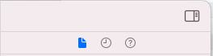 

**Size Inspector ⌥ - ⌘ - 6**
The size inspector lets us set a frame size, and adjust the constraints as well as the content Jusgging Priority and Content Compression Resistance Priority. 

All great stuff!
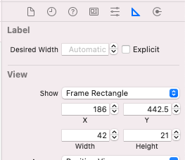 

**Connection Inspector ⌥ - ⌘ - 7**
You can visually see the outlets that have been set! You can even click from the not filled in circle. These are really good features for you. Nice.
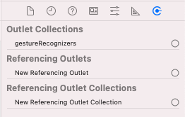 

# Conclusion

This article is meant to give a whirlwind tour of the Inspector Bar. It's all good stuff, and getting used to Xcode and the tools that you are given will certainly make you a better developer over time.

This is certainly something that you would want, right?

I hope this article has helped you out with this goal!

If you've any questions, comments or suggestions please hit me up on [Twitter](https://twitter.com/stevenpcurtis)
