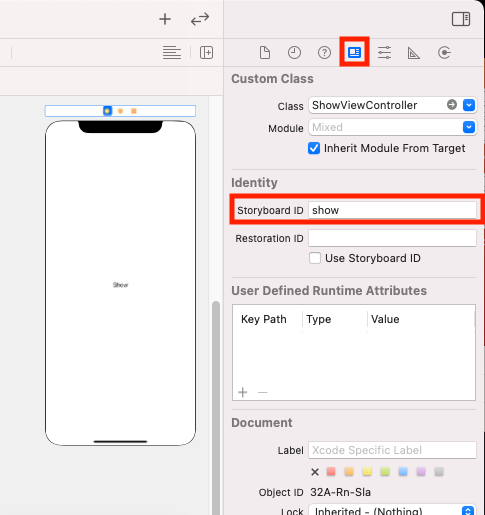

# A Mixed Economy: Xib and Storyboards
## You can have both!

Difficulty: Beginner | **Easy** | Normal | Challenging<br/>
This article has been developed using Xcode 12.5, and Swift 5.4

# Prerequisites:
* You will be expected to be aware how to make a [Single View Application](https://medium.com/swlh/your-first-ios-application-using-xcode-9983cf6efb71)

# Terminology
Storyboard: A visual representation of the User Interface of an Application
NIB and XIB: Files built using Interface Builder to describe the user interface. NIB stands for NeXTSTEP Interface Builder, XIB stands for Xcode Interface Builder.

# The Implementation
We might wish to load a XIB file from a storyboard. Equally we might wish to load a View Controller from a XIB file.

This article will take us through both implementations.

## Loading a NIB from the Storyboard
If we are in a View Controller loaded from the Storyboard we can programatically load the view controller. This example uses a View Controller called `DetailViewController`:

```swift
let viewController = DetailViewController(nibName: "DetailViewController", bundle: nil)
```

Now within my code I have then pushed this onto a `navigationController` with `navigationController?.pushViewController(viewController, animated: true)`.

## Loading a Storyboard view controller from the NIB
Assuming we have a storyboard called `Main`, we can instantiate a View Controller from the Storyboard so long as we have set an identifier in the storyboard

<br>

Now in order to select the identity inspector:
<br>

So then it is possible to select the identifier on the right-hand side.

We can then programatically match the name of the Storyboard ("Main") and the view controller identifier ("show")

```swift
let storyboard = UIStoryboard(name: "Main", bundle: nil)
let vc = storyboard.instantiateViewController(withIdentifier: "show")
```

# Conclusion
I've used this technique on projects where the storyboard is getting a little too big, and I've needed to extend the functionality. In this case adding `nib` files to the project really helped me out - and I hope that this article has helped you out too!

Happy coding!

If you've any questions, comments or suggestions please hit me up on [Twitter](https://twitter.com/stevenpcurtis)
