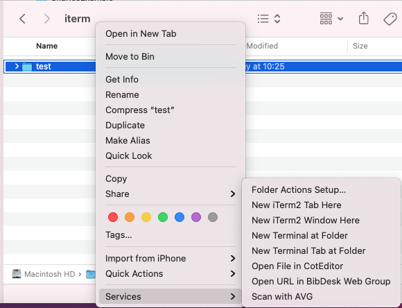
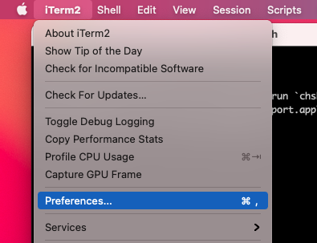
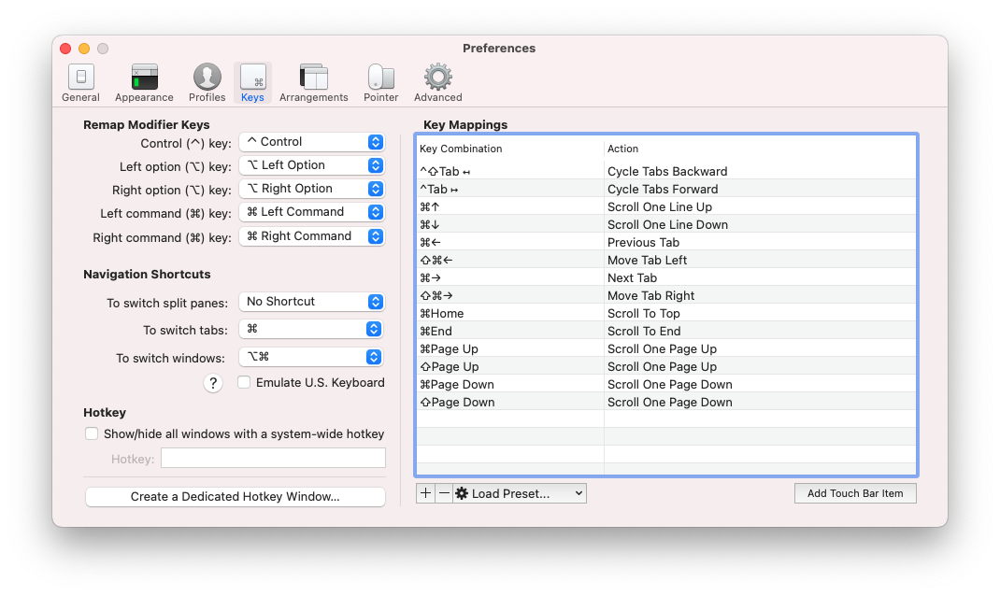
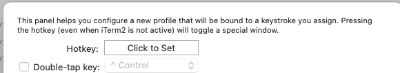
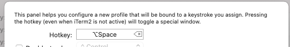
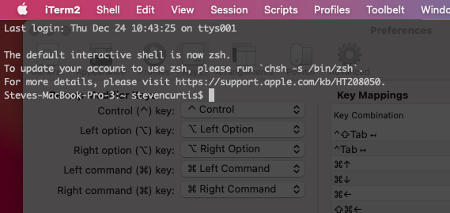

# Make your life easier with iTerm2
## It really does

# Before we start
Difficulty: Beginner | **Easy** | Normal | Challenging 
This article has been developed using Xcode 12.2, and Swift 5.3

## Prerequisites:
* I have already written a guide on [The Mac Terminal](https://medium.com/@stevenpcurtis.sc/the-mac-terminal-998eb9f42b5). This guide isn't about that! Rather, this guide is about iTerm2 - and read on for why you should care about this terminal replacement.

## Keywords and Terminology:
Terminal: an interface that allows you to access the command line

# Why choose iTerm2 over the Terminal
The Mac has a [great Terminal](https://medium.com/@stevenpcurtis.sc/the-mac-terminal-998eb9f42b5), and if you are using Git or other development tools you are almost certain to be typing commands in the Terminal. What is important is the speed of your work, and being able to do things in an efficient way is aways important, and a great thing to do to get your setup **just right**. With that said, we should press on with those great features:

* Split panes so you can see your Terminal work side-by-side
* Hotkeys that work globally
* Search that works with Regular Expressions
* Autocomplete
* Copy + Paste history
* Loads of configuration options

# Installation
You can install iTerm2 by [traversing to their website](https://www.iterm2.com/downloads.html) and following the instructions contained there

# Looking at these features and use them step-by-step

## Open up iTerm2 from the finder
One way of opening up iTerm2 is to right-click on any folder or file and select Services>New iTerm2 Window Here.
 

Which will then open a terminal at that location (you can then confirm the location of your window with the command `pwd`).

Alternatively you may set up a hotkey for iTerm: option ⌥ - Space is a good combination (similar to Spotlight, but different enough to avoid annoying mistakes!). To do so open iTerm, and choose preferences from the iTerm2 menu
 
you can choose the "Create a Dedicated Hotkey Window" button in the bottom-left hand corner of the window
 
which can then be set as option ⌥ - Space
 
then we can record the Hotkey
 
which then presents a rather snazzy overlay
 
which can then be used in conjunction with typing cd in the terminal and then drag-dropping a folder into the window - then you will be at the appropriate spot in iTerm. Great!

## Copy text
Whether you are using Terminal or iTerm2, you can use your mouse and select text to copy. Great. But users of the Terminal frequently want to use features without removing their hands from the keyboard. Luckily with iTerm2 you can copy and paste without that hassle.

Use `Command ⌘ - f` to search for any String within the window (and this string will be selected), and then move left (additionally select the word to the left) with `shift ⇧-tab ↹` and right (additionally select the word to the right) with `tab ↹`. You can then select copy mode with `Shift ⇧ - Command ⌘ - C`, press escape and then we can do the traditional `⌘ - P` to paste.

An alternative? Just use the keyboard by moving to copy mode with `Shift ⇧ - Command ⌘ - C`, move with the arrows (or for [VIM fans](https://medium.com/@stevenpcurtis.sc/using-vim-as-a-text-editing-tool-on-the-mac-9595c1122e91) you can use h,j,k and l) along with the use of space to select the text. Again, an escape and a `⌘ - P` will paste.

Oh, [copy mode has more keystrokes](https://iterm2.com/documentation-copymode.html) so that might be of use for you.

If you're a mouse-only user double-click in order to copy. you can then simply `⌘ - P` to paste. Awesome!

Now inside the toolbelt `Shift ⇧ -⌘ - B` or `Toolbelt>Show Toolbelt` you can see the paste history, although you will need to select the paste history on [toolbelt](Images/toolbelt.png)

## Command-Click links
If there is a link in your window, for example here where I haven't updated this machine to zsh 
[notupdatedbash](Images/notupdatedbash.png) 
you can move the mouse over the item and command `⌘` click to pen the link.

This also works for other application files too!

## Split Window
`Command⌘ - D` means that we can have a vertical split of terminal windows. This is incredibly nice!
[verticalsplit]](Images/verticalsplit.png) makes having two windows.
If you want horizontal `⌘ + Shift + D` is your command!

Alternatively take a look at the Window menu items.

## Go back in time
It is common for interactive command line applications to wipe over what happened in the past.
`Command ⌘ - Option ⌥ - B` or through the menu through `View>Start Instant Replay`

## Paste history
There is a great option and is viewable from the Toolbelt (`Shift ⇧ -⌘ - B` or `Toolbelt>Show Toolbelt`) and `Paste History` can be seected, and rather as expected you can see the items that you have previously pasted into the terminal window.

## A Wonderful Search
You can even use regex for searched. Rather than being limited through just `⌘ - F` there is a friendly-looking magnifying class and further options there.
[searchregex](Images/searchregex.png) 
Regex? Yes please!

## Autocomplete
By starting to write something, and the using tab you will be able to use Autocomplete. This is rather great!

You can enable this with `cmd ;` which puts a rather nice autocompletion box below your cursor

[autocomplete](Images/autocomplete.png) 

If you would like autocomplete to work with just the tab key this is possible by installing with [homebrew](https://stevenpcurtis.medium.com/set-up-a-development-environment-on-a-mac-e73deabfdbf7) and running `brew install bash-completion` as specified [here](https://github.com/bobthecow/git-flow-completion/wiki/Install-Bash-git-completion#homebrew)

# Conclusion
When coding getting a grip of the tools at your disposal is really important. Not only that, getting to grips with tools that aren't the default can give you an edge. 

This article has given you some ways to make your life a little easier, and I hope it has done just that.

In any case, happy coding! 

If you've any questions, comments or suggestions please hit me up on [Twitter](https://twitter.com/stevenpcurtis)
